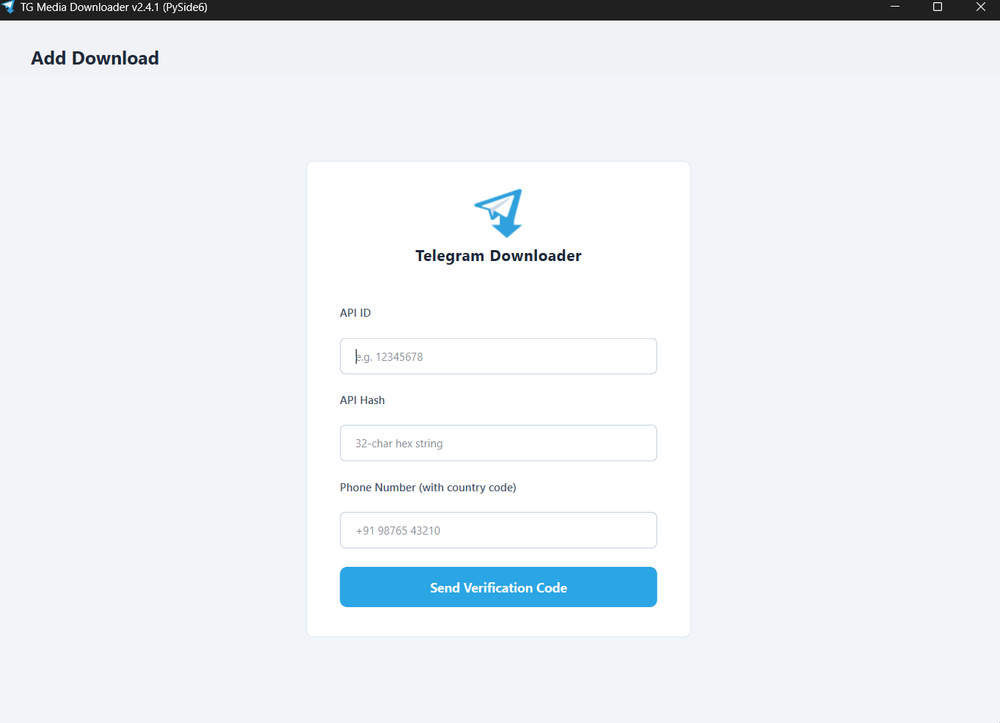
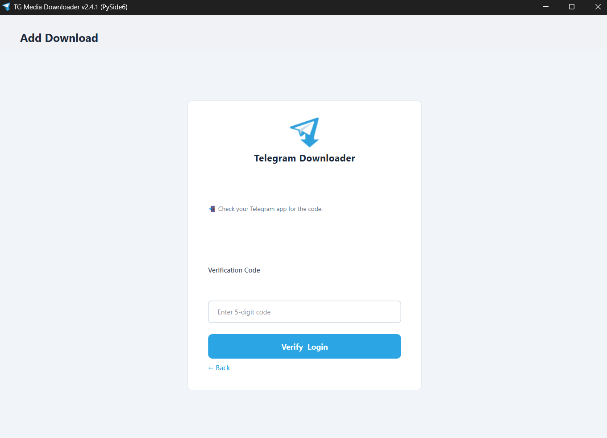
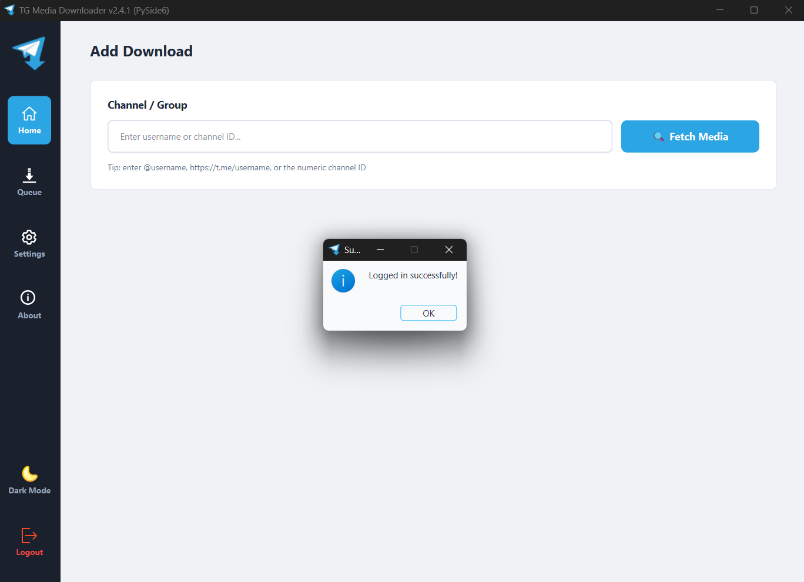
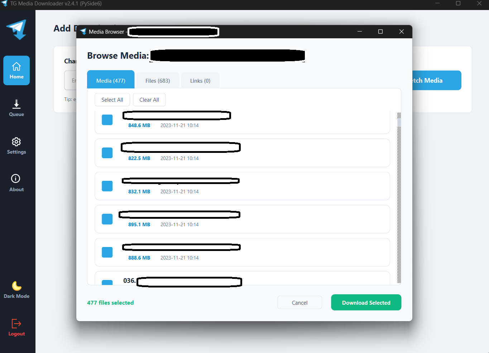
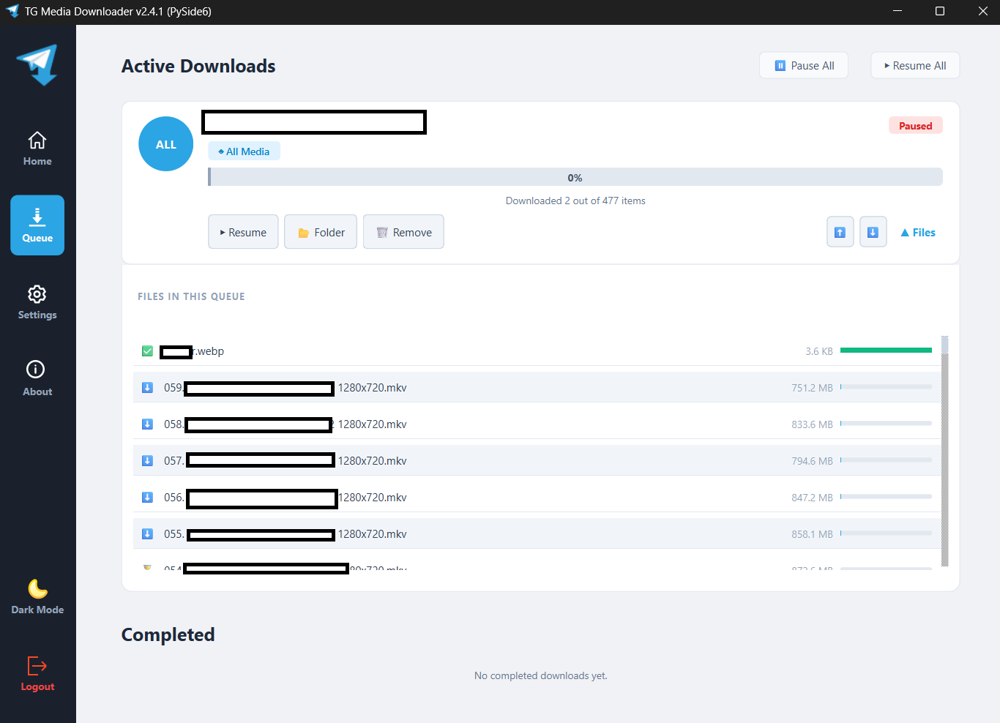
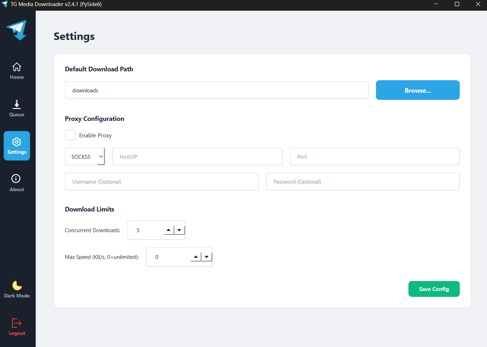

# Telegram Bulk Media Downloader

[](https://github.com/vinodkr494/telegram-media-downloader/releases/latest)
[](https://github.com/vinodkr494/telegram-media-downloader/releases)

Telegram Bulk Media Downloader is a Python-based desktop app that lets you browse, filter, and bulk-download media from any Telegram channel or group — with a **completely rebuilt PySide6 UI**, modular architecture, and enhanced background threading for 24/7 reliability.

---

## ✨ What's New in v2.4.2 (UI Polishing & Fixes)

### 🎨 Premium Media Browser UI
The media selection interface has been upgraded to a **modern card-based layout**. This provides better visual feedback for file types and improves clarity when selecting multiple items for download.

### 🌓 Robust Theme Persistence
Your preference for **Light or Dark mode** is now saved and restored instantly upon restart, ensuring a consistent user experience.

### 🛠️ UI/UX Enhancements
- **Clean Empty States**: Beautiful placeholders for the Home and Queue views when no tasks are active.
- **Smart Queue Controls**: "Pause All" and "Resume All" buttons now only appear when relevant, keeping the interface clean.
- **Smooth Navigation**: Refined sidebar transitions and icon persistence.

---

## Features

- 🌀 **Animated Spinner** — braille animation on the Fetch overlay — no more frozen screen
- 🔍 **Media Browser Search** — live filter bar to find any file by name instantly
- ✅ **Selection Counter** — "X of Y files selected" counter updates as you tick boxes
- 🔔 **Toast Notifications** — bottom-right popup when a queue completes, auto-dismisses in 3s
- 📥 **Empty State Screens** — friendly placeholders on Home and Downloads before any tasks are added
- 📂 **Media Browser** — category-based file browser (Media, Files, Music, Links, GIFs)
- ⚡ **Parallel Fetch** — all categories load simultaneously via `asyncio.gather` (~5x faster)
- 🔁 **Smart Deduplication** — skips already-downloaded files by name and size
- ⏸ **Concurrent Downloads** — configurable parallel streams with pause / resume support
- 📊 **Per-file Progress Bars** — live speed display (KB/s / MB/s) per file
- **Speed Limiter** — configurable max download speed in Settings
- **Proxy Support** — SOCKS4, SOCKS5, HTTP, and MTProto configuration
- **Theme Toggle** — Light and Dark mode from Settings
- **Persistent Queue** — saves and restores on restart automatically
- **Cross-Platform** — standalone executables for Windows, Linux, and macOS

## Screenshots

<p align="center">
  
  
</p>

<p align="center">
  
</p>

<p align="center">
  
</p>

<p align="center">
  
</p>

<p align="center">
  
</p>

## Requirements

- Python 3.8+
- Telegram API credentials (API ID and API Hash)

## Installation

### Method 1: Download the Executable (Recommended)

1. Go to the [Releases](https://github.com/vinodkr494/telegram-media-downloader/releases) page.
2. Download the latest `TGDownloader-vX.X.X-Windows.exe` (or your OS version).
3. Run directly — no Python or installation required!

> **Note:** Windows may show a "Smart App Control" warning because the executable is unsigned. Click **More info → Run anyway**.

### Method 2: Run from Source

1. Clone the repository:

    ```bash
    git clone https://github.com/vinodkr494/telegram-media-downloader.git
    cd telegram-media-downloader
    ```

2. Install dependencies:

    ```bash
    pip install -r requirements.txt
    ```

3. Create a `.env` file:

    ```env
    API_ID=your_api_id
    API_HASH=your_api_hash
    SESSION_NAME=default_session
    ```

4. Run the GUI:
    ```bash
    python src/gui.py
    ```

## Usage

1. **Log in** with your Telegram API credentials and phone number.
2. On the **Home** tab, enter a channel username (e.g. `@channelname`) or channel ID (e.g. `-100123456789`).
3. Click **🔍 Fetch Media** to open the **Media Browser**.
4. Browse files by category — use **Select All** or check individual files.
5. Click **Download Selected** to add them to your queue.
6. Track live progress and speed in the **Downloads** tab.

### Resuming Downloads

Progress is saved to `download_state.json`. Restart the app and your queue resumes automatically, skipping already-completed files.

### Configure Concurrent Downloads

Go to **Settings → Download Limit** to adjust how many files download simultaneously (default: 5).

### Configure Speed Limit

Go to **Settings → Max Download Speed** and drag the slider to your preferred cap. Set to 0 for unlimited.

### Supported Media Types

| Type | Format |
|------|--------|
| Videos | `.mp4`, `.mkv`, `.avi`, and more |
| Images | `.jpg`, `.png`, `.webp`, and more |
| PDFs | `.pdf` |
| ZIP / Archives | `.zip`, `.rar`, `.7z` |
| Audio | `.mp3`, `.ogg`, `.flac`, and more |
| GIFs | Telegram animated GIFs |

## Changelog

### v2.4.3
- 🆔 **Robust Numeric IDs** — aggressively normalizes private channel numeric IDs (automatically applying `-100` prefixes) to prevent `PeerUser` fetch errors
- 📦 **Deep Dialog Scanning** — automatically requests and searches all `Archived` dialogs if a private channel ID isn't found in the active chat list
- 🛑 **Error Diagnostics** — updated MainWindow status tracking to avoid getting stuck "Fetching..." forever when an ID lookup fundamentally fails

### v2.4.2
- 🎭 **Premium Card UI** — implemented a sleek card-based layout for the media browser tabs
- 💾 **Persistent Themes** — fixed theme restoration bug, ensuring light/dark mode sticks across sessions
- 🧹 **UI Cleanup** — refined empty state logic and dynamic visibility of queue controls
- 🐞 **General Fixes** — resolved several minor layout and focus issues for a more stable experience

### v2.4.1
- 🚀 **Full PySide6 Rewrite** — migrated from CustomTkinter for native performance
- 🏗️ **Modular UI** — sidebar navigation with dedicated views (Home, Queue, Settings)
- 🌑 **Premium Theming** — full QSS-based Light/Dark mode support
- 🔒 **Enhanced Auth** — multi-step Phone/OTP/2FA login flow
- 📊 **Improved Queue** — per-task download cards with robust pause/resume/cancel
- 📁 **Modular Workers** — thread-safe `TelegramWorker` for background operations
- ⚙️ **Config Persistence** — settings now save to `config.json` automatically

### v2.3.0
- ✅ Animated braille spinner on the Fetch Media overlay
- ✅ Real-time search/filter bar inside every Media Browser tab
- ✅ Live `"X of Y files selected"` counter (turns green when files are selected)
- ✅ Toast notification on download queue completion (bottom-right, 3s auto-dismiss)
- ✅ Empty state screens for Home and Downloads views on fresh launch
- ✅ Fixed `Download Selected` modal not closing (tuple unpacking bug from v2.3 refactor)
- ✅ Updated About screen with v2.3 features and responsible-use warning
- ✅ Full `CONTRIBUTING.md` with setup guide, architecture, and PR checklist
- ✅ Legal Disclaimer added to README

### v2.2.0
- ✅ Added **Media Browser** with category tabs (Media, Files, Music, Links, GIFs)
- ✅ Parallel category fetching with `asyncio.gather` (~5x faster)
- ✅ Per-file **deduplication** (skip existing files at correct size)
- ✅ **Speed Limiter** slider in Settings
- ✅ Fixed phantom pause bug (`asyncio.CancelledError` in progress callback)
- ✅ Fixed `sqlite3 database is locked` crash on download start
- ✅ Fixed `Select All` not properly queuing files for download
- ✅ Fixed UI freeze caused by progress event flooding

### v2.1.0
- ✅ Proxy support (SOCKS4/5, HTTP, MTProto)
- ✅ Dark/Light theme toggle
- ✅ Persistent download queue across restarts

### v2.0.0
- ✅ Complete UI rewrite — modern CustomTkinter dashboard
- ✅ Sidebar navigation, download cards, per-file progress bars
- ✅ `cryptg` hardware acceleration for fast Telegram downloads

## Roadmap

Future improvements are tracked as [GitHub Issues](https://github.com/vinodkr494/telegram-media-downloader/issues). Have an idea? Open a feature request!

## ⚠️ Legal Disclaimer

> [!CAUTION]
> **This tool is intended for personal and legitimate use only.**
>
> - Only download content from channels and groups **you own or have explicit permission to access**.
> - Respect Telegram's [Terms of Service](https://telegram.org/tos) at all times.
> - Do **not** use this tool to infringe copyright, redistribute paid content, or violate anyone's privacy.
> - The author and contributors are **not responsible** for any misuse, damages, or legal consequences arising from the use of this software.
> - Use entirely at your own risk.

This software interacts with Telegram's official API via [Telethon](https://github.com/LonamiWebs/Telethon). It does not bypass any Telegram security mechanisms.

---

## Contributing

We welcome contributions of all kinds! Please read the [CONTRIBUTING.md](CONTRIBUTING.md) file for the full guide including:
- Environment setup
- Project architecture
- Commit message conventions
- PR checklist
- Areas that need help

## License

This project is licensed under the MIT License. See the [LICENSE](LICENSE) file for details.

## Acknowledgments

- [Telethon](https://github.com/LonamiWebs/Telethon) — Telegram API integration
- [PySide6](https://pypi.org/project/PySide6/) — Native Python bindings for Qt WebEngine/Widgets
- [cryptg](https://github.com/LonamiWebs/cryptg) — C-based crypto for fast downloads
- [Pillow](https://python-pillow.org/) — Image processing

---

Made with ❤️ by [Vinod Kumar](https://github.com/vinodkr494).
