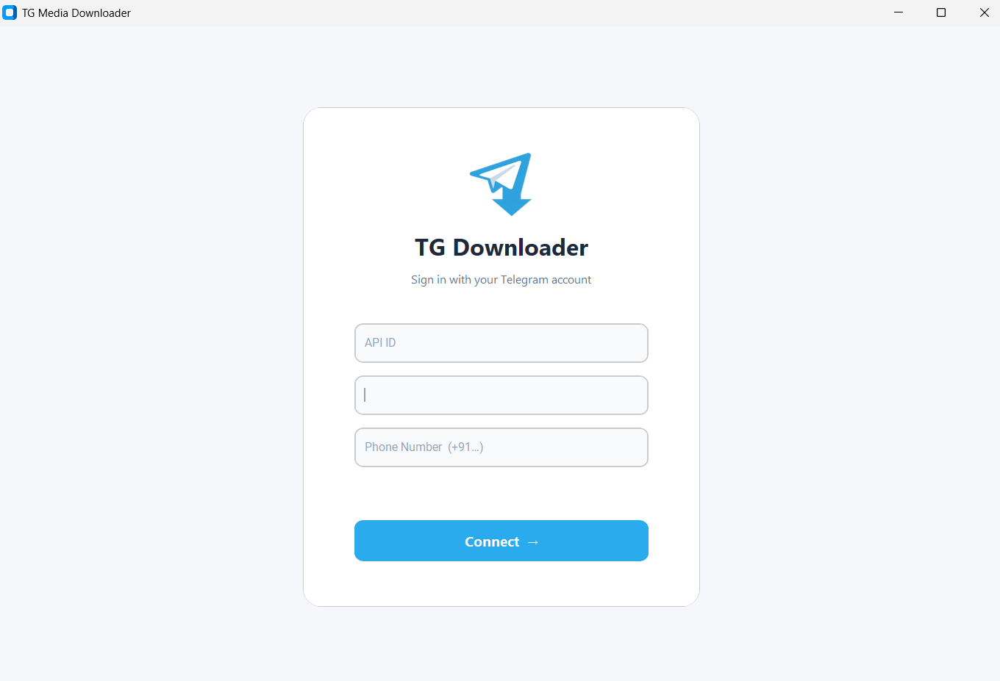
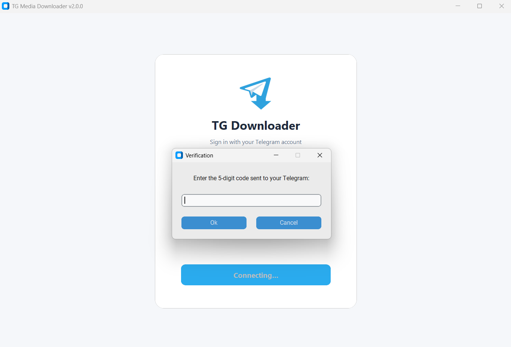
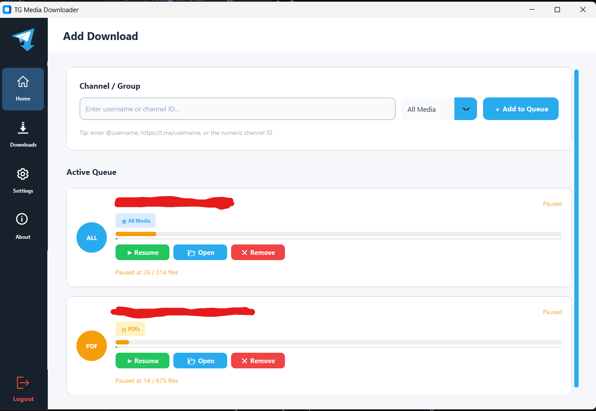

# Telegram Bulk Media Downloader

[](https://github.com/vinodkr494/telegram-media-downloader/releases/latest)
[](https://github.com/vinodkr494/telegram-media-downloader/releases)

Telegram Bulk Media Downloader is a Python-based desktop app that lets you browse, filter, and bulk-download media from any Telegram channel or group — with a beautiful modern UI, smart deduplication, speed limiting, and category-based file browsing.

---

## ✨ What's New in v2.2

### 📂 Media Browser
Browse your channel's entire media library **before** downloading. Filter by category (Media, Files, Music, Links, GIFs), use **Select All / Clear All**, and only queue the files you actually want.

- Fetches all categories **in parallel** for fast load times
- Tabs show live item counts per category (e.g. `Files (500)`)
- Select individual files with checkboxes and click **Download Selected**

### 🔁 Smart File Deduplication
Before downloading any file, the app checks if it already exists on disk at the correct file size. If it does, the file is silently skipped — saving time and bandwidth.

### ⚡ Speed Limiter
Set a maximum download speed (in KB/s) from the **Settings** panel using a slider. Useful when you want the downloads to run in the background without consuming all your bandwidth.

### 🐛 Core Stability Fixes
- Fixed phantom "Download Paused" bug caused by raising `asyncio.CancelledError` inside Telethon progress callbacks
- Fixed `sqlite3.OperationalError: database is locked` caused by Telethon's session SQLite being accessed from multiple threads
- Fixed UI freezing due to flooding the Tkinter event queue with thousands of progress updates per second
- Fixed `Select All` not including files when clicking `Download Selected`

---

## Features

- **Media Browser**: Category-based file browser — browse Photos, Videos, Documents, Music, and more before downloading
- **Parallel Fetch**: All category filters run concurrently via `asyncio.gather` for near-instant channel scanning
- **Smart Deduplication**: Skips already-downloaded files automatically by comparing file names and sizes
- **Speed Limiter**: Configurable download speed cap (KB/s) to prevent bandwidth saturation
- **Modern UI (v2.0+)**: Premium CustomTkinter interface with sidebar navigation, progress bars, and status cards
- **Persistent Queue**: Download queue and progress automatically saved and restored on restart
- **Batch Processing**: Configurable concurrent downloads (parallel streams)
- **Multi-Media Support**: Videos, Images, PDFs, ZIP files, Audio, GIFs, and more
- **Progress Tracking**: Per-file progress bars with live speed display (KB/s / MB/s)
- **Proxy Support**: SOCKS4, SOCKS5, HTTP, and MTProto proxy configuration in Settings
- **Theme Toggle**: Switch between Light and Dark mode from the Settings panel
- **Cross-Platform Executables**: Standalone `.exe` / binaries via GitHub Actions for Windows, Linux, and macOS

## Screenshots





## Requirements

- Python 3.8+
- Telegram API credentials (API ID and API Hash)

## Installation

### Method 1: Download the Executable (Recommended)

1. Go to the [Releases](https://github.com/vinodkr494/telegram-media-downloader/releases) page.
2. Download the latest `TGDownloader-vX.X.X-Windows.exe` (or your OS version).
3. Run directly — no Python or installation required!

> **Note:** Windows may show a "Smart App Control" warning because the executable is unsigned. Click **More info → Run anyway**.

### Method 2: Run from Source

1. Clone the repository:

    ```bash
    git clone https://github.com/vinodkr494/telegram-media-downloader.git
    cd telegram-media-downloader
    ```

2. Install dependencies:

    ```bash
    pip install -r requirements.txt
    ```

3. Create a `.env` file:

    ```env
    API_ID=your_api_id
    API_HASH=your_api_hash
    SESSION_NAME=default_session
    ```

4. Run the GUI:
    ```bash
    python src/gui.py
    ```

## Usage

1. **Log in** with your Telegram API credentials and phone number.
2. On the **Home** tab, enter a channel username (e.g. `@channelname`) or channel ID (e.g. `-100123456789`).
3. Click **🔍 Fetch Media** to open the **Media Browser**.
4. Browse files by category — use **Select All** or check individual files.
5. Click **Download Selected** to add them to your queue.
6. Track live progress and speed in the **Downloads** tab.

### Resuming Downloads

Progress is saved to `download_state.json`. Restart the app and your queue resumes automatically, skipping already-completed files.

### Configure Concurrent Downloads

Go to **Settings → Download Limit** to adjust how many files download simultaneously (default: 5).

### Configure Speed Limit

Go to **Settings → Max Download Speed** and drag the slider to your preferred cap. Set to 0 for unlimited.

### Supported Media Types

| Type | Format |
|------|--------|
| Videos | `.mp4`, `.mkv`, `.avi`, and more |
| Images | `.jpg`, `.png`, `.webp`, and more |
| PDFs | `.pdf` |
| ZIP / Archives | `.zip`, `.rar`, `.7z` |
| Audio | `.mp3`, `.ogg`, `.flac`, and more |
| GIFs | Telegram animated GIFs |

## Changelog

### v2.2.0
- ✅ Added **Media Browser** with category tabs (Media, Files, Music, Links, GIFs)
- ✅ Parallel category fetching using `asyncio.gather` (~5x faster)
- ✅ Per-file **deduplication** (skip existing files at correct size)
- ✅ **Speed Limiter** slider in Settings
- ✅ Fixed immediate pause bug (`asyncio.CancelledError` in progress callback)
- ✅ Fixed `sqlite3 database is locked` crash on download start
- ✅ Fixed `Select All` not properly queuing files for download
- ✅ Fixed UI freeze caused by progress event flooding

### v2.1.0
- ✅ Proxy support (SOCKS4/5, HTTP, MTProto)
- ✅ Dark/Light theme toggle
- ✅ Persistent download queue across restarts

### v2.0.0
- ✅ Complete UI rewrite — modern CustomTkinter dashboard
- ✅ Sidebar navigation, download cards, per-file progress bars
- ✅ `cryptg` hardware acceleration for fast Telegram downloads

## Roadmap

### v2.3 (Upcoming)
- **Animated Loading Spinner** on fetch overlay
- **Search Filter** inside Media Browser
- **Toast Notifications** when a download queue completes
- **Empty State Screens** for Home and Downloads tabs
- **Concurrent Download Slider** in Settings

## ⚠️ Legal Disclaimer

> [!CAUTION]
> **This tool is intended for personal and legitimate use only.**
>
> - Only download content from channels and groups **you own or have explicit permission to access**.
> - Respect Telegram's [Terms of Service](https://telegram.org/tos) at all times.
> - Do **not** use this tool to infringe copyright, redistribute paid content, or violate anyone's privacy.
> - The author and contributors are **not responsible** for any misuse, damages, or legal consequences arising from the use of this software.
> - Use entirely at your own risk.

This software interacts with Telegram's official API via [Telethon](https://github.com/LonamiWebs/Telethon). It does not bypass any Telegram security mechanisms.

---

## Contributing

We welcome contributions of all kinds! Please read the [CONTRIBUTING.md](CONTRIBUTING.md) file for the full guide including:
- Environment setup
- Project architecture
- Commit message conventions
- PR checklist
- Areas that need help

## License

This project is licensed under the MIT License. See the [LICENSE](LICENSE) file for details.

## Acknowledgments

- [Telethon](https://github.com/LonamiWebs/Telethon) — Telegram API integration
- [CustomTkinter](https://github.com/TomSchimansky/CustomTkinter) — Beautiful modern UI widgets
- [cryptg](https://github.com/LonamiWebs/cryptg) — C-based crypto for fast downloads
- [Pillow](https://python-pillow.org/) — Image processing

---

Made with ❤️ by [Vinod Kumar](https://github.com/vinodkr494).
