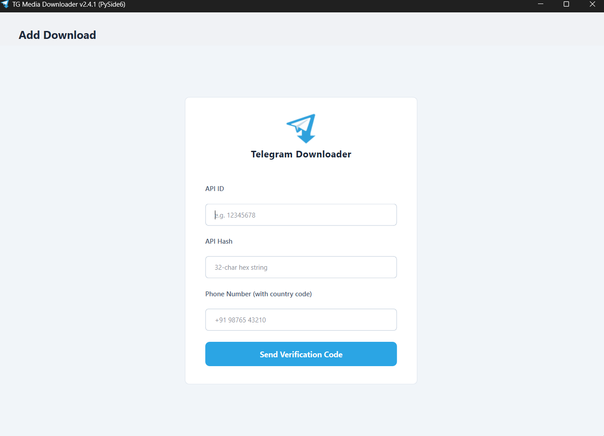
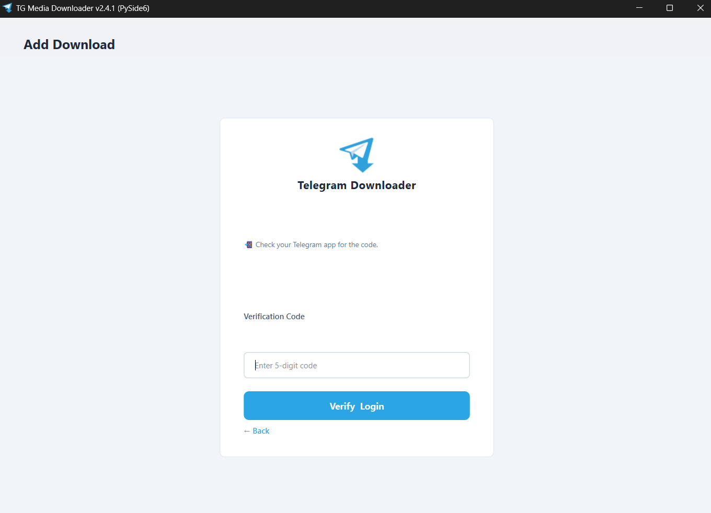
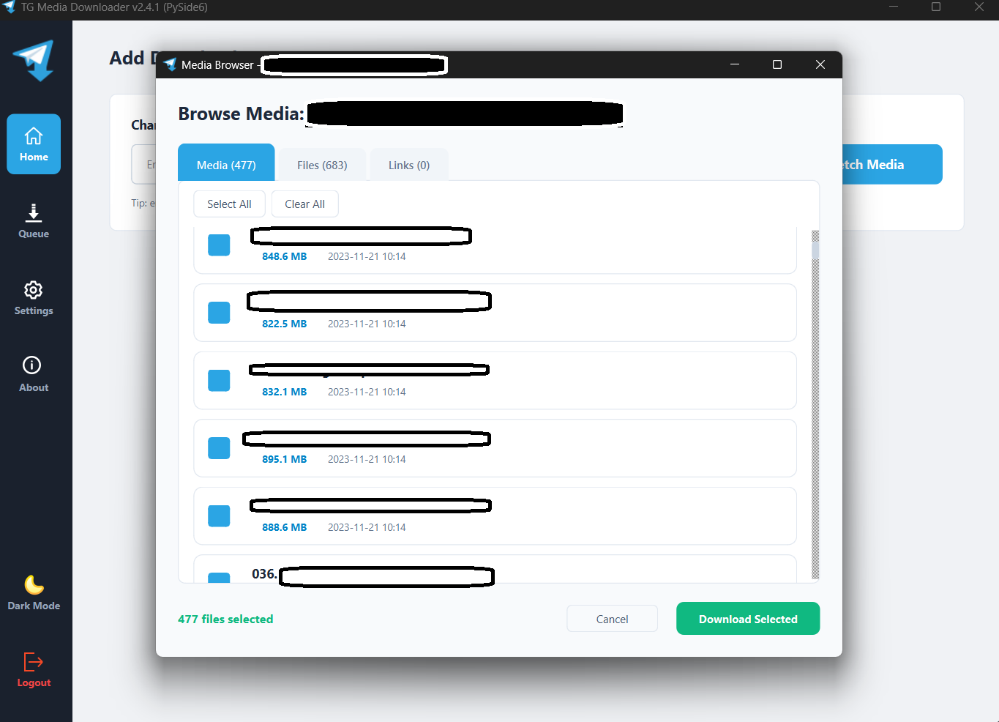
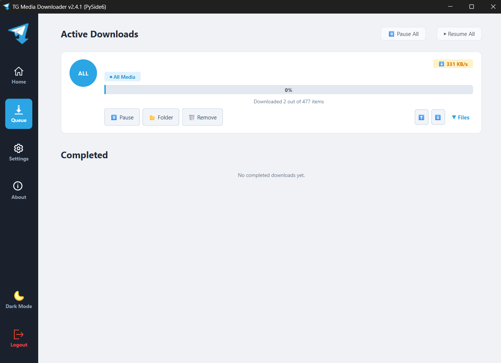
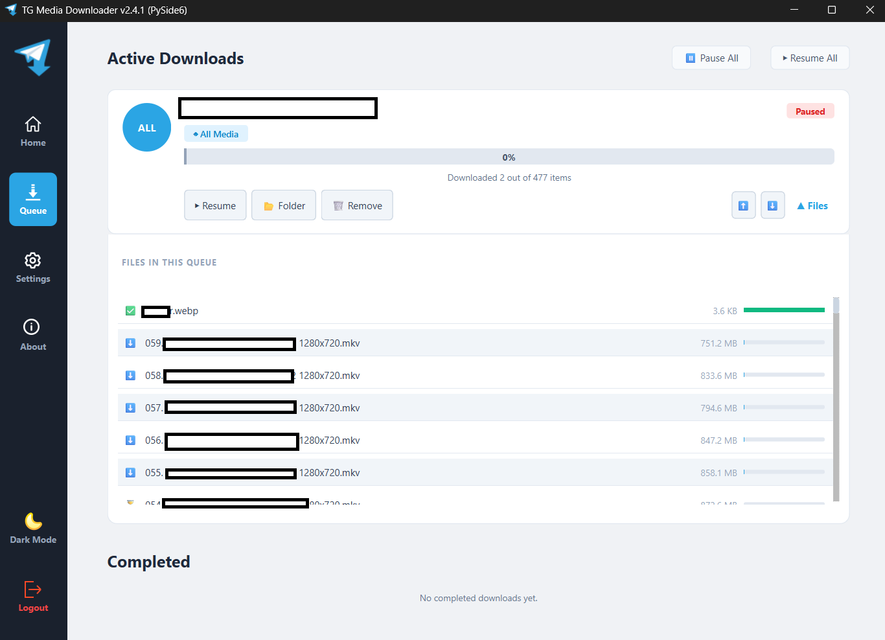
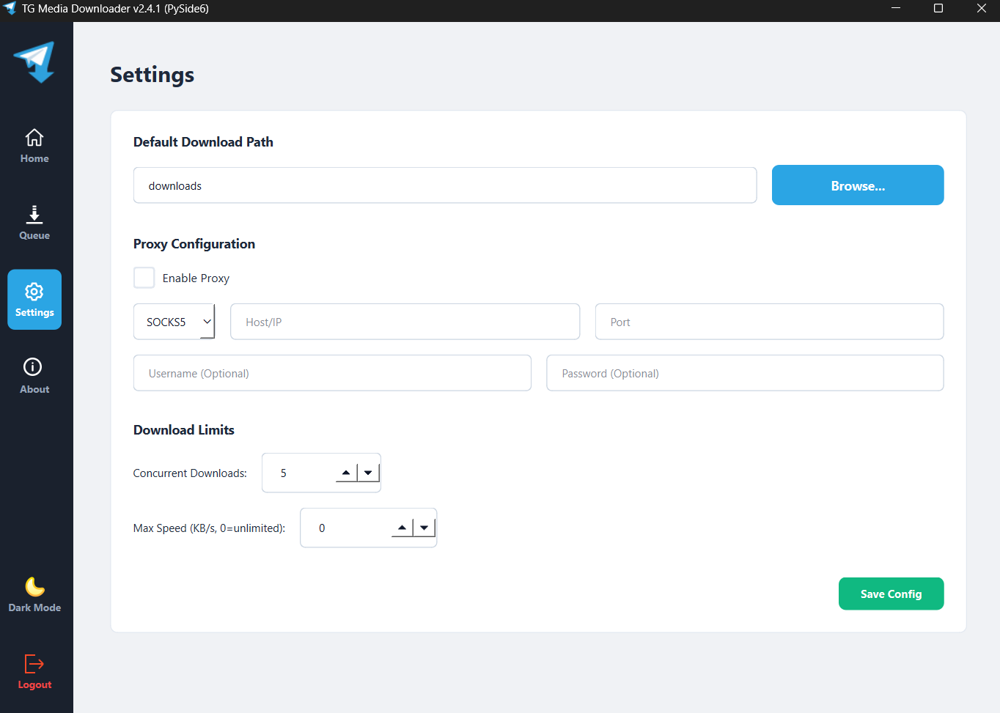

# Telegram Bulk Media Downloader

[](https://github.com/vinodkr494/telegram-media-downloader/releases/latest)
[](https://github.com/vinodkr494/telegram-media-downloader/releases)
🚀 **Bulk-download videos, images, PDFs, audio & more** from any Telegram channel or group. Features a **Premium PySide6 Dashboard** with high-performance analytics, **Global Queue Tracking** (Total progress % & Session usage), **Advanced Task Management** (Prioritize & Cancel), category browser, real-time search, parallel downloads, smart deduplication, speed limiter, proxy support, and desktop notifications.

### 🗄️ SQLite Persistence Engine
Transitioned from legacy JSON files to a robust, indexed **SQLite database**. All tasks, message IDs, and download states are now stored with full data integrity.

### 🚀 Instant Media Browser
Experience zero-wait browsing. The application now **caches all media types** locally, allowing you to open the browser instantly with previously fetched data while the background worker refreshes the list from Telegram.

### 📏 768p Display Optimization
Refined UI dimensions and dialog heights (max 650px) to ensure a **perfect fit on standard laptop displays** and low-resolution monitors.

### 🛡️ Channel-Isolated Progress
Eliminated cross-channel ID collisions. Download completion and selection status are now tracked independently per channel, ensuring 100% accuracy in large queues.

### 🎨 Theme-Aware Context Menus
Context menus (Right-Click) now dynamically adopt the application's theme, providing a consistent premium experience in both Light and Dark modes.

### 📁 Downloaded Files Manager
A dedicated **Files** management dashboard allowing you to search, filter, and organize all completed downloads. Easily open files, show them in File Explorer, remove items from download history, or permanently delete files from disk with multi-select bulk operations.

### ⚡ FastTelethon Multi-Part Turbo Downloader
Equipped with parallel chunk streaming (4 worker connections x 512 KB chunks) for media files > 1 MB, achieving maximum network throughput and up to 10x–20x faster download speeds.

### 🔄 Smart Re-Download of Deleted Files
Built-in physical disk presence verification. If you delete any files or folders from your computer, the app detects the missing files and allows you to re-download them seamlessly.

### 📅 Publication Date Media Naming
All downloaded media (images, videos, documents, audio) can now be automatically prefixed with their publication date (e.g. `2026-01-01_filename.mp4` or `2026-01-01_Photo_123.jpg`), replacing random numeric document IDs for videos and keeping download folders organized chronologically.

---

## Features

- 📁 **File Manager** — dedicated management tab to view, search, open, and delete downloaded items
- ⚡ **FastTelethon Turbo Engine** — multi-part parallel chunk streaming for ultra-fast downloads
- 💎 **Premium Sidebar** — sleek, icon-based navigation with professional typography
- 📊 **Global Dashboard Status** — real-time session stats, total progress %, and smoothed combined speed
- 🔔 **Native Notifications** — system-level alerts when your downloads are ready
- 🖱 **Intuitive Gestures** — double-click cards to open folders; auto-focus search on open
- 🔄 **Queue Prioritization** — move entire download batches up or down to manage your queue
- 🔍 **Media Browser Search** — live filter bar to find any file by name instantly
- ✅ **Selection Counter** — "X of Y files selected" counter updates as you tick boxes
- 📥 **Empty State Screens** — friendly placeholders on Home and Downloads before any tasks are added
- 📂 **Media Browser** — category-based file browser (Media, Files, Music, Links, GIFs)
- ⚡ **Parallel Fetch** — all categories load simultaneously via `asyncio.gather` (~5x faster)
- 🔁 **Smart Deduplication** — skips already-downloaded files by name and size with physical disk checks
- 📅 **Publication Date Naming** — automatically prefix files with `YYYY-MM-DD` and cleanly name untitled videos/photos
- ⏸ **Concurrent Downloads** — configurable parallel streams with pause / resume support
- 📊 **Per-file Progress Bars** — live speed display (KB/s / MB/s) with EMA smoothing
- **Speed Limiter** — configurable max download speed in Settings
- **Proxy Support** — SOCKS4, SOCKS5, HTTP, and MTProto configuration
- **Theme Toggle** — Light and Dark mode with persistent session saving
- **Persistent Queue** — saves and restores on restart automatically with SQLite
- **Cross-Platform** — standalone executables for Windows, Linux, and macOS

---

## Screenshots

<p align="center">
  
  
</p>

<p align="center">
  
</p>

<p align="center">
  
</p>
<p align="center">
  
</p>

<p align="center">
  
</p>

---

## Requirements

- Python 3.8+
- Telegram API credentials (API ID and API Hash)

---

## Installation

### Method 1: Download the Executable (Recommended)

1. Go to the [Releases](https://github.com/vinodkr494/telegram-media-downloader/releases) page.
2. Download the latest `TGDownloader-vX.X.X-Windows.exe` (or your OS version).
3. Run directly — no Python or installation required!

> **Note:** Windows may show a "Smart App Control" warning because the executable is unsigned. Click **More info → Run anyway**.

### Method 2: Run from Source

1. Clone the repository:

    ```bash
    git clone https://github.com/vinodkr494/telegram-media-downloader.git
    cd telegram-media-downloader
    ```

2. Install dependencies:

    ```bash
    pip install -r requirements.txt
    ```

3. Create a `.env` file:

    ```env
    API_ID=your_api_id
    API_HASH=your_api_hash
    SESSION_NAME=default_session
    ```

4. Run the GUI:
    ```bash
    python src/gui.py
    ```

## Usage

1. **Log in** with your Telegram API credentials and phone number.
2. On the **Home** tab, enter a channel username (e.g. `@channelname`) or channel ID (e.g. `-100123456789`).
3. Click **🔍 Fetch Media** to open the **Media Browser**.
4. Browse files by category — use **Select All** or check individual files.
5. Click **Download Selected** to add them to your queue.
6. Track live progress, total queue stats, and session throughput in the **Downloads** tab.
7. Manage your completed downloads in the **Files** tab (open files, show in explorer, delete from list or disk).

### Resuming Downloads

Progress is saved automatically. Restart the app and your queue resumes seamlessly, skipping already-completed files.

### Configure Concurrent Downloads

Go to **Settings → Download Limit** to adjust how many files download simultaneously (default: 5).

---

## Changelog

### v2.8.3
- 🎯 **Fixed Premature Queue Completion**: Fixed queue download cards immediately showing as "Completed ✓" when downloading multiple channels or batches. Scoped task initial completion counters strictly to the current task's message set instead of counting all historical channel downloads.
- 🔒 **Channel State & ID Isolation**: Isolated channel download states to prevent sequential message ID collisions between channels.
- 🛡️ **Guarded Preallocated `.part` Finalization**: Prevented FastTelethon preallocated full-size `.part` files from falsely being finalized as complete without verified `.part.meta` chunk metadata.
- 🧹 **Orphaned `.part` & `.meta` File Cleanup**: Automatically cleans up residual `.part` and `.meta` files upon completion, fallback, or when the target file already exists.
- ⚡ **FloodWait Recovery & Worker Teardown**: Fully honors Telegram `FloodWaitError` durations and gracefully cancels background workers before closing file handles.

### v2.8.2
- ⚡ **Resuming Stall & Concurrency Deadlock Fix**: Resolved the critical issue where parallel downloads permanently froze at `Resuming...` with 0 B/s due to missing MTProto request timeouts. Added a 25s timeout with exponential retry backoff to prevent dropped connections from locking worker coroutines and exhausting concurrency slots.
- 📦 **Instant Complete `.part` File Finalization**: Implemented instant detection and atomic finalization for `.part` files matching the expected Telegram media size. Automatically flushes file handles, atomically replaces `.part` to final filenames with Windows file-lock retry handling, and marks database records completed.
- 🔄 **Byte-Range Resumable Chunk Tracking**: Added `.part.meta` chunk-state sidecars to record downloaded chunk indices. Paused or interrupted downloads now accurately download only missing chunks upon resume without wiping or corrupting existing progress.
- 🏷️ **Deduplication Filename Stability**: Fixed duplicate filename generation so that restarting or resuming a task reuses its existing in-progress `.part` filename instead of repeatedly appending `(2)`, `(3)`, etc.
- 🛡️ **Verify & Persistence Reconciliation**: Enhanced the "🛡️ Verify" button to check both primary file paths and database paths against disk. If files are deleted or moved, it cleanly reconciles database completion counters, updates progress bars, and enables the "▶ Resume" button for 1-click re-downloading.

### v2.8.1
- 🛡️ **Concurrent Duplicate Renaming Fix**: Resolved parallel download race conditions in `get_unique_filepath` by dynamically reserving in-flight filenames and detecting `.part` files, preventing simultaneous duplicate downloads from colliding or abandoning `.part` files.
- ⚙️ **Configurable Moved/Deleted Files Re-download**: Added a toggle under Download Settings (`"Re-download Files If Deleted/Moved from Folder"`, default disabled) so moving completed downloads to other folders or drives won't trigger unwanted re-downloads.
- 🧹 **FastTelethon Error Cleanup**: Added automatic removal of `.part` temporary files on download failure or cancellation.

### v2.8.0
- 📁 **Dedicated File Manager**: Added a full-featured "Files" tab in the sidebar to manage your download list, search and filter files by category/status, view total disk usage, open files/folders directly, and delete items from history or disk.
- ⚡ **FastTelethon Turbo Multi-Part Downloader**: Integrated high-speed parallel chunk streaming (4 worker streams x 512KB chunks) for large files (>1 MB), providing up to 10x–20x faster download throughput.
- 🔄 **Re-downloading Deleted Files**: Added physical disk presence scanning (`os.path.exists`) so deleting files/folders from your computer allows them to be re-downloaded seamlessly rather than getting stuck in a false completed state.
- 📊 **Silky-Smooth Speed Tracking**: Implemented Exponential Moving Average (EMA) speed smoothing to eliminate erratic speed jumping in the UI.
- 🛡️ **Multi-Category Bulk Download Fix**: Fixed ghost card collisions and category filtering in bulk mode.

### v2.7.7
- 📅 **Publication-Date Filename Formatting**: Added option to prefix all downloaded media (images, videos, documents, audio) with publication date (`YYYY-MM-DD_<filename>`) for tidy chronological organization.
- 🎥 **Clean Video & Media Naming**: Replaced random Telegram 64-bit document IDs for videos without metadata names with clean, predictable identifiers (`Video_<id>.mp4` / `2026-01-01_Video_<id>.mp4`).
- ⚙️ **GUI Config Toggle**: Added "Prefix Filenames with Publication Date (YYYY-MM-DD)" checkbox under Download Settings.

### v2.7.6
- 🔄 **Prevent File Overwriting**: Added option to rename duplicate files with a suffix (e.g. `video (2).mp4`) instead of overwriting, with persistent resume mapping in the SQLite database.
- 📅 **Message Timestamp Matching**: Added option to automatically set downloaded media and sidecar text file modification/accessed times to match the Telegram message creation date.
- ⚙️ **GUI Config Toggles**: Integrated both features as custom checkboxes under Download Settings.

### v2.7.5
- 📁 **Custom Folder Naming**: Support `{username}` and `{channel_id}` placeholders in the download path template settings.
- 📂 **Forum Topic Auto-separation**: Option to automatically download all topics from a forum into separate subfolders named after the topics when the main channel ID is provided.

### v2.7.1
- 🍎 **Intel Mac Support**: Added support for Intel-based Macs (x86_64 architecture). The build workflow now produces separate `.dmg` installers for both Apple Silicon (ARM64) and Intel Macs, ensuring full compatibility across all macOS devices.


### v2.6.7
- 🛠️ **Fixed PhotoSize Deduplication Bug**: Fixed the `AttributeError: 'PhotoSize' object has no attribute 'location'` error that occurred during deduplication checks before download in Telethon 1.38.1.
- 🎨 **UI Layout Improvements**: Fixed vertical alignment of the bulk download checkboxes on the "Ready for Bulk Download" page and eliminated visual stretching.
- 🔤 **Font Warnings Fix**: Replaced point-based font sizes (`8.5pt`) with pixel-based (`11px`) in stylesheets to eliminate `QFont::setPointSize` terminal warnings and ensure consistent, cleaner font rendering.

### v2.6.6
- 🍎 **macOS DMG Fix**: Completely refactored the macOS build process to produce a working `.dmg` installer with a proper `.app` bundle.
- 📦 **Improved CI/CD**: Updated GitHub Actions to automate DMG creation using `dmgbuild`.
- 🛠️ **Build Optimization**: Simplified build scripts and unified artifact naming across Windows, Linux, and macOS.

### v2.6.5
- ⚙️ **Custom Scan Limit**: Added support for configuring the initial media fetching limit in Settings (previously hardcoded to 500).

- 🎨 **Premium Sponsor Site**: Launched a dedicated, professional landing page to showcase project impact and support options.
- 🧹 **Maintenance**: Internal refactoring to improve data persistence and scanning reliability.

### v2.6.4
- 🧵 **Forum Topic Support**: Full support for downloading from specific Telegram forum topics and sub-channels using the `channelID_topicID` format or direct topic URLs.
- 🐞 **Parse Engine Fixes**: Enhanced task ID management and parsing logic to seamlessly pause and resume topic-scoped tasks.
- 🛡️ **GetRepliesRequest Fix**: Refactored `client.get_messages` implementation to prevent API crashes when querying default message feeds.

### v2.6.3
- 🛠️ **Fixed Photo Download Bug**: Resolved the critical `AttributeError: 'PhotoSize' object has no attribute 'location'` that prevented image downloads in Telethon 1.38.1.
- 🛡️ **Robust Fallback Engine**: Implemented a multi-strategy download system for photos to handle Telegram API layer regressions across different versions.

### v2.6.2
- 🛠️ **Refined Instant Loading:** Improved cached media UI mapping to show exact file sizes and dynamic emojis without visual lag.
- 🛑 **Robust Background Fetching:** Fixed Telethon's internal "closed the connection" drops by pacing parallel chunk streams more smoothly.
- ⚡ **Resilient Resuming:** Solved a critical file-resumption bug by accurately instructing the download engine via explicit pathing, preventing offset overrides and 0-byte restarts.
- 🎨 **Responsive UX:** Instant loading indications are now immediately flushed to the UI queue for zero perceived wait time during database queries.

### v2.6.0
- 🗄️ **SQLite Persistence Engine** — transitioned from legacy JSON files to a robust, indexed SQLite database for all tasks and download history.
- 🚀 **Instant Media Browser** — introduced high-performance content caching. Browse previously fetched media instantly while the app refreshes in the background.
- 📏 **768p Display Optimization** — refined window heights and dialog constraints to ensure a perfect fit on standard laptop and low-resolution displays.
- 🛡️ **Channel-Isolated Progress** — eliminated cross-channel ID collisions. Download progress and completion status are now tracked independently per channel.
- 🎨 **Theme-Aware Menus** — context menus now dynamically adopt Light/Dark mode styling for a cohesive premium experience.

### v2.5.0
- 🎨 **UI Overhaul** — replaced legacy emoji-based navigation with professional, high-quality icon assets and refined QSS typography.
- 📊 **Global Analytics** — introduced real-time session data, total completion %, and consolidated status bar metrics.
- ⚡ **Queue Mastery** — added Cancel (Remove) and Prioritize (Up/Down) functionality to the download cards.
- 🔔 **Native Feedback** — implemented desktop notifications for task completion and an enhanced tray context menu.
- 🖱 **Double-Click Gestures** — double-click task cards to jump directly to the download folder.
- 🔍 **Search Focus** — auto-focuses the search bar upon opening the Media Browser for faster filtering.

### v2.4.7
- 💾 **Robust Persistence** — centralized all persistent files (`.env`, `config.json`, `download_state.json`, `active_tasks.json`, and `.session`) fixing persistence issues in standalone builds.
- 🌓 **Improved .env Logic** — added automatic quote stripping for `API_ID` and `API_HASH` and persisted `PHONE` for a seamless login experience.
- 🛡️ **Path Resolver Sync** — ensured all UI components and background workers use the centralized `get_project_root` helper.

### v2.4.5
- ⏯️ **Pause Reliability** — implemented active task tracking to prevent duplicate background threads; clicking "Pause" now reliably stops all activity for that task immediately
- 📐 **Sidebar Polish** — reduced layout margins and button margins to ensure "Light Mode" and "Dark Mode" labels fit within the 85px sidebar on all displays
- 💾 **Persistent Resume** — fixed a state-management bug that caused paused tasks to auto-resume unexpectedly after a restart

### v2.4.4
- 🔗 **Invite-Link Download Fix** — fixed `FileReferenceExpiredError` for private channels joined via invite links by manually refreshing the message entity on retry
- 🌓 **Cross-Platform Dark Mode Detection** — app now auto-detects OS dark mode at startup (Windows registry, macOS `defaults`, Linux `gsettings`/`$GTK_THEME`)
- 🎨 **Startup Theme Fix** — eliminated black flash on Windows Dark Mode; sidebar toggle button now syncs to the detected theme on launch
- 💾 **Theme Persistence** — user's chosen theme is saved to `config.json` and restored on next launch, overriding the system default

### v2.4.3
- 🆔 **Robust Numeric IDs** — aggressively normalizes private channel numeric IDs (automatically applying `-100` prefixes) to prevent `PeerUser` fetch errors
- 📦 **Deep Dialog Scanning** — automatically requests and searches all `Archived` dialogs if a private channel ID isn't found in the active chat list
- 🛑 **Error Diagnostics** — updated MainWindow status tracking to avoid getting stuck "Fetching..." forever when an ID lookup fundamentally fails

### v2.4.2
- 🎭 **Premium Card UI** — implemented a sleek card-based layout for the media browser tabs
- 💾 **Persistent Themes** — fixed theme restoration bug, ensuring light/dark mode sticks across sessions
- 🧹 **UI Cleanup** — refined empty state logic and dynamic visibility of queue controls
- 🐞 **General Fixes** — resolved several minor layout and focus issues for a more stable experience

### v2.4.1
- 🚀 **Full PySide6 Rewrite** — migrated from CustomTkinter for native performance
- 🏗️ **Modular UI** — sidebar navigation with dedicated views (Home, Queue, Settings)
- 🌑 **Premium Theming** — full QSS-based Light/Dark mode support
- 🔒 **Enhanced Auth** — multi-step Phone/OTP/2FA login flow
- 📊 **Improved Queue** — per-task download cards with robust pause/resume/cancel
- 📁 **Modular Workers** — thread-safe `TelegramWorker` for background operations
- ⚙️ **Config Persistence** — settings now save to `config.json` automatically

### v2.3.0
- ✅ Animated braille spinner on the Fetch Media overlay
- ✅ Real-time search/filter bar inside every Media Browser tab
- ✅ Live `"X of Y files selected"` counter (turns green when files are selected)
- ✅ Toast notification on download queue completion (bottom-right, 3s auto-dismiss)
- ✅ Empty state screens for Home and Downloads views on fresh launch
- ✅ Fixed `Download Selected` modal not closing (tuple unpacking bug from v2.3 refactor)
- ✅ Updated About screen with v2.3 features and responsible-use warning
- ✅ Full `CONTRIBUTING.md` with setup guide, architecture, and PR checklist
- ✅ Legal Disclaimer added to README

### v2.2.0
- ✅ Added **Media Browser** with category tabs (Media, Files, Music, Links, GIFs)
- ✅ Parallel category fetching with `asyncio.gather` (~5x faster)
- ✅ Per-file **deduplication** (skip existing files at correct size)
- ✅ **Speed Limiter** slider in Settings
- ✅ Fixed phantom pause bug (`asyncio.CancelledError` in progress callback)
- ✅ Fixed `sqlite3 database is locked` crash on download start
- ✅ Fixed `Select All` not properly queuing files for download
- ✅ Fixed UI freeze caused by progress event flooding

### v2.1.0
- ✅ Proxy support (SOCKS4/5, HTTP, MTProto)
- ✅ Dark/Light theme toggle
- ✅ Persistent download queue across restarts

### v2.0.0
- ✅ Complete UI rewrite — modern CustomTkinter dashboard
- ✅ Sidebar navigation, download cards, per-file progress bars
- ✅ `cryptg` hardware acceleration for fast Telegram downloads

## Roadmap

We are currently focused entirely on stabilizing and improving the robustness of existing features.

If you have an idea or suggestion for a new feature, please join our [GitHub Discussions (Ideas)](https://github.com/vinodkr494/telegram-media-downloader/discussions/categories/ideas) instead of opening an issue. Issues are now strictly reserved for bug reports.

## ⚠️ Legal Disclaimer

> [!CAUTION]
> **This tool is intended for personal and legitimate use only.**
>
> - Only download content from channels and groups **you own or have explicit permission to access**.
> - Respect Telegram's [Terms of Service](https://telegram.org/tos) at all times.
> - Do **not** use this tool to infringe copyright, redistribute paid content, or violate anyone's privacy.
> - The author and contributors are **not responsible** for any misuse, damages, or legal consequences arising from the use of this software.
> - Use entirely at your own risk.

This software interacts with Telegram's official API via [Telethon](https://github.com/LonamiWebs/Telethon). It does not bypass any Telegram security mechanisms.

---

## Contributing

We welcome contributions of all kinds! Please read the [CONTRIBUTING.md](CONTRIBUTING.md) file for the full guide including:
- Environment setup
- Project architecture
- Commit message conventions
- PR checklist
- Areas that need help

## License

This project is licensed under the MIT License. See the [LICENSE](LICENSE) file for details.

## Acknowledgments

- [Telethon](https://github.com/LonamiWebs/Telethon) — Telegram API integration
- [PySide6](https://pypi.org/project/PySide6/) — Native Python bindings for Qt WebEngine/Widgets
- [cryptg](https://github.com/LonamiWebs/cryptg) — C-based crypto for fast downloads
- [Pillow](https://python-pillow.org/) — Image processing

## 🌟 About The Project

**Telegram Bulk Media Downloader** is a high-performance, open-source initiative dedicated to providing a premium, desktop-native solution for archiving and managing Telegram content. 

Our mission is to bridge the gap between complex terminal-based downloaders and the user-friendly experience that modern creators and researchers deserve. By combining the robust [Telethon](https://github.com/LonamiWebs/Telethon) engine with a world-class **PySide6 Dashboard**, we've created a tool that is both incredibly powerful and effortless to use.

---

## ☕ Support & Donation

If you find this tool helpful and want to support its continued development, please consider:

- **⭐ Star this repository** to help others find it.
- **💖 Sponsor on GitHub**: [Sponsor @vinodkr494](https://github.com/sponsors/vinodkr494)

Your support helps cover the costs of testing, maintenance, and new features!

---

Made with ❤️ by [Vinod Kumar](https://github.com/vinodkr494).

[](https://star-history.com/#vinodkr494/telegram-media-downloader&Date)
